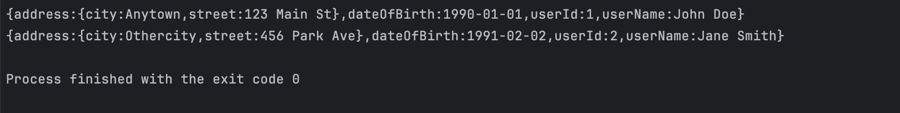

## CSV to JSON Converter in Golang
This project provides a Golang-based solution to convert CSV data to JSON format using a user-defined mapping configuration. It leverages concurrent processing to handle large CSV files efficiently.

## How It Works
1. CSV to JSON Mapping Configuration to Encoded String Template 
2. Eg:
` {
   "id": "{column1}",
   "name": "{column2}",
   "details": {
   "age": "{column3}",
   "address": "{column4}"
   }
   }`
   In this example: {column1}, {column2}, {column3}, and {column4} are placeholders that correspond to specific columns in the CSV file.
2. Parallel Reading of CSV Data
3. Replace Placeholders with Actual CSV Data
4. Display generated string

## Output:

